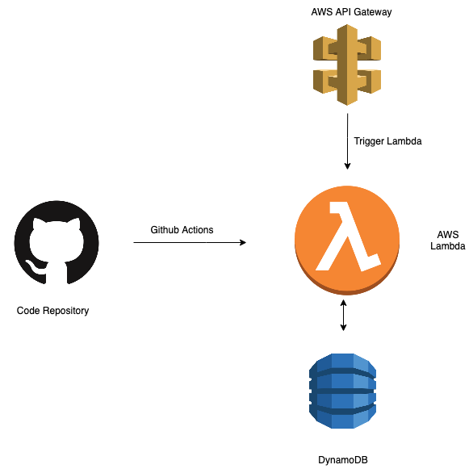

# Basic Auth Implementation

This project implements basic auth functionality on nodejs using inversion.

## Inversion Implementation

The project demonstrates the use of IoC and injecting services onto inversify controllers.

The project contains a `user` service, and I have also implemented a dynamodb layer on top of the service and injected it in the container.

One can easily create other database layers and inject the required as per the use case.

NOTE: The project with inversion methodolgy is a overkill for a basic auth implementation. This repository is only for demonstration purposes.

## Lambda Implementation

This repository contains a action which zips the code and deploys it to a lambda function. Exact implementation can be found in the [main.yml](./.github/workflows/main.yml) file.

This repository does not use any automated deployment libraries like serverless or SAM. It manually deploys code to a lambda function.

Creating a trigger point for the lambda and dynamodb tables workflows is not included in the project.

The repository demonstrates deploying code to lambda which is a part of "behind the scenes" of automated workflows, and can be used for education purposes and building concepts on AWS Lambda.

## Endpoints

1. /auth/login

    Body:
     
    `
    {
        "username": "YourUsername",
        "password": "YourPassword"
    }
    `

2. /auth/register

    Body:
     
    `
    {
        "username": "YourUsername",
        "email": "YourEmail",
        "password": "YourPassword"
    }
    `

## Installation

    npm install

To compile typescript into javascript

    npm run build

## Start

    npm start